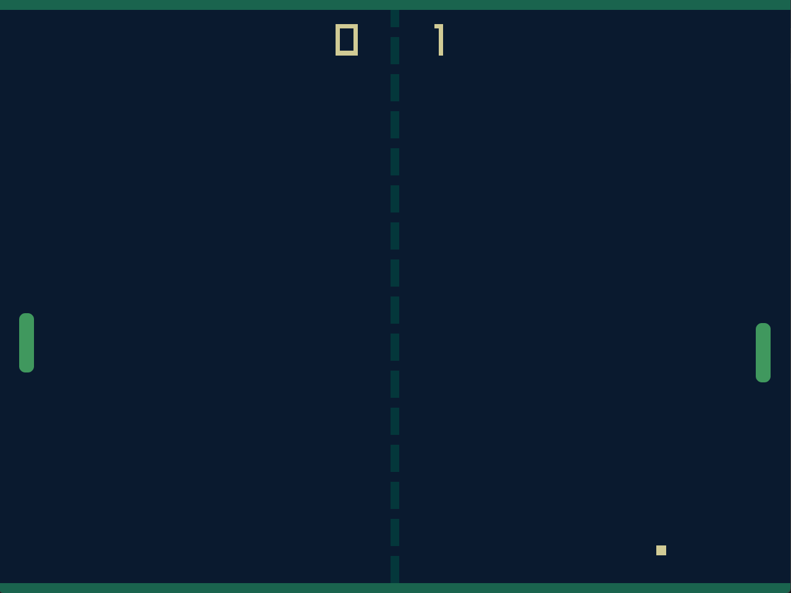

# Peter Pong

A two-player Pong game built in **C++** using the **raylib** game library. Developed as a hands-on C++ project to practice game architecture, object-oriented design, and real-time game loop patterns.

<h3>Features</h3>

- Two-player local multiplayer on a single keyboard
- Ball speed increases with each paddle hit, up to a configurable maximum, creating escalating difficulty
- Angle-based ball deflection — where the ball hits the paddle determines its outgoing trajectory
- First to 11 points wins, with a game-over screen and win sound effect
- Round timer with a short delay between points before the next round starts
- Custom warm color palette with pixel-art style paddle textures
- Sound effects for ball hits, scoring, and game win
- Locked at 60 FPS for consistent gameplay

<h3>Technical Highlights</h3>

- Object-oriented design with `PongGame`, `Player`, and `Ball` classes
- Game loop split into a `GameTick` (logic) and `RenderTick` (rendering) for clean separation of concerns
- `std::unique_ptr` used throughout for safe memory management
- Ball physics driven by velocity vectors with configurable speed constants (`InitialBallSpeed`, `MaxBallSpeed`, `BallSpeedStep`)
- Goal detection via a `std::function` callback (`OnGoal`) decoupling the ball from game state
- State machine managing `PreGame`, `MidGame`, and `EndGame` phases
- CMake build system with raylib fetched and built automatically as a dependency

<h3>Controls</h3>

| Player | Up | Down |
|--------|----|------|
| Player 1 | `W` | `S` |
| Player 2 | `↑` | `↓` |

<h3>Play</h3>

Download the executable from the [GitHub Releases](https://github.com/petegilb/peterpong/releases) page and run it — no install required.

<h3>Build from Source</h3>

Requires CMake 3.15+ and a C++17 compiler. raylib is fetched automatically.

```bash
cmake -S . -B cmake-build-release -DCMAKE_BUILD_TYPE=Release
cmake --build cmake-build-release
```

<h3>Third Party Assets</h3>

- [raylib](https://www.raylib.com/) — game library (zlib license)
- [Win Jingle Sound CC0](https://opengameart.org/content/win-jingle) — game win sound effect

<h3>Screenshot</h3>


